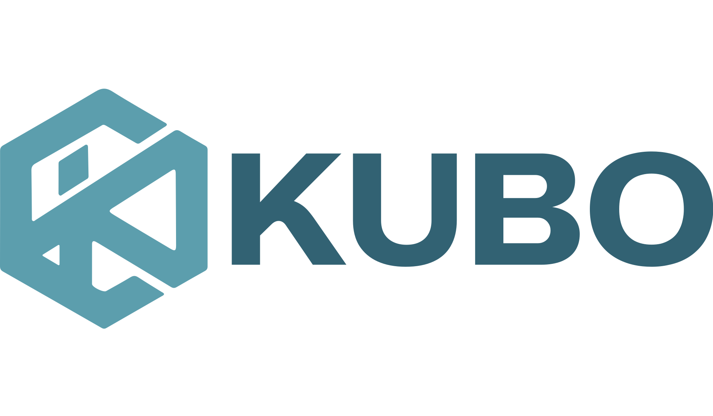

# 🔷 Kubo — Organizador Financeiro

> Um aplicativo de organização financeira pessoal moderno, ultrarrápido, seguro e focado na sua privacidade. Inspirado na estética **Apple Liquid Glass (visionOS / iOS 26)**.



---

## ⚡ Diferenciais do Kubo

- 🔒 **100% Privado e Local**: Seus dados nunca saem do seu dispositivo. Sem cadastro, sem servidores externos e sem mensalidades.
- 📱 **Mobile First & PWA Ready**: Funciona como um aplicativo nativo no celular (iOS e Android) ou no computador.
- ✨ **Design Liquid Glass**: Interface fluida, responsiva, com suporte completo a **Modo Escuro** e **Modo Claro** (com detecção automática do dispositivo).
- 🔒 **Bloqueio de Segurança por PIN**: Proteja suas finanças com uma senha PIN de 4 dígitos (com suporte a teclado físico e virtual).

---

## 🚀 Funcionalidades Principais

### 📊 1. Dashboard & Visão Geral
- **Patrimônio Líquido Total**: Cálculo em tempo real do saldo acumulado em todas as suas contas.
- **Resumo do Mês**: Visualização instantânea de Entradas, Saídas e Saldo do mês ativo.
- **Gráficos Interativos**: Distribuição de gastos por categoria e fluxo de caixa.

### 💳 2. Gestão de Contas & Cartões
- Cadastre contas bancárias, carteiras e cartões de crédito.
- Acompanhamento de limites de crédito disponíveis e fechamento de faturas.

### 📝 3. Extrato Completo & Transações
- Adição rápida de receitas e despesas.
- Suporte a **compras parceladas** (criação automática de parcelas futuras).
- Categorização personalizada com ícones e cores.
- Busca e ordenação avançada por período e tipo.

### 📅 4. Contas a Pagar & Receber
- Controle de contas recorrentes e boletos com data de vencimento.
- Marcação com 1 clique de contas pagas ou pendentes.

### 🎯 5. Metas Financeiras
- Defina objetivos de economia (ex: Reserva de Emergência, Viagens, Veículo).
- Acompanhe a barra de progresso e faça depósitos ou resgates.

### 💾 6. Backup & Portabilidade
- **Exportar/Importar Backup JSON**: Alterne entre dispositivos sem perder seus dados.
- **Exportar para CSV**: Exporte relatórios para o Excel ou Google Planilhas.

---

## 🛠️ Tecnologias Utilizadas

- **HTML5 Semantic & PWA Metadata**
- **Vanilla CSS (Sem frameworks)**: CSS Custom Properties, Glassmorphism avançado, Backdrop Filters e Animações Fluídas.
- **Vanilla JavaScript (ES6+)**: Sistema de estado desacoplado, sem dependências externas pesadas.
- **SVG Vector Graphics**: Biblioteca de ícones vetoriais embutida para carregamento instantâneo.

---

## 💻 Como Rodar Localmente

Como o projeto é construído em web standards puras, você **não precisa instalar Node.js ou dependências**:

1. Clone o repositório ou baixe o ZIP:
   ```bash
   git clone https://github.com/SEU-USUARIO/kubo-organizador-financeiro.git
   ```
2. Abra o arquivo `index.html` diretamente em qualquer navegador moderno (Chrome, Safari, Edge, Firefox).

---

## 🌐 Publicar no GitHub Pages (Gratuito)

Para deixar seu aplicativo 100% online:

1. No seu repositório do GitHub, vá em **Settings** (Configurações) → **Pages**.
2. Em **Branch**, selecione `main` e a pasta `/ (root)`.
3. Clique em **Save**.
4. Acesse seu link público: `https://seu-usuario.github.io/kubo-organizador-financeiro/`

---

## 📱 Como Adicionar na Tela do Celular (App PWA)

- **iPhone (Safari)**: Toque no botão **Compartilhar** ➔ **"Adicionar à Tela de Início"**.
- **Android (Chrome)**: Toque nos **3 pontos** ➔ **"Adicionar à Tela Inicial"** ou **"Instalar aplicativo"**.

---

## 📄 Licença

Este projeto está sob a licença [MIT](LICENSE). Sinta-se livre para usar, modificar e distribuir!
